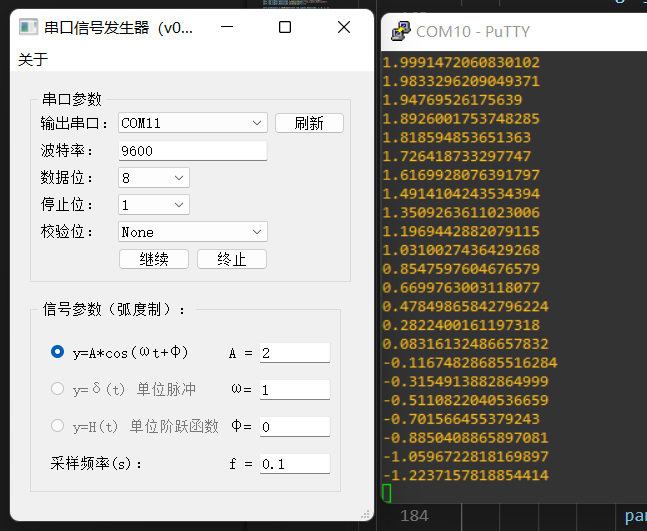

# yan_serial_tools
一个使用[PySide2](https://pypi.org/project/PySide2/) 做GUI 的串口工具，可以使用[Nuitka](https://github.com/Nuitka/Nuitka) 打包为独立的可执行程序

目前实现了：  
- [x] 图形界面：`python .\signal_generator.py`
- [x] 信号发生器：[设计思路](https://12tall.github.io/python/multithread/signal-generator.html)  
- [ ] 示波器

## 信号发生器  
  

## 示波器  
> todo  

## 参考
1. [PySide2 入门教程](https://github.com/se7enXF/pyside2)